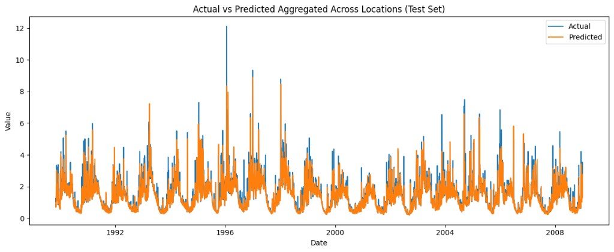

# Time series benchmarking tutorial (Hydrology CAMELS US with Chronos 2)

## Project title, introduction, and team members

This repository is a DS5110 final project framework for benchmarking single-step time series forecasting on hydrology data from CAMELS-US using Chronos-2.

Team member:
- Junyang He

## Problem Statement

The project evaluates how well a time-series foundation model (Chronos-2) can forecast next-day streamflow across multiple US river basins.  
Task definition:
- Forecast type: single-step forecasting
- Forecast horizon: 1 day
- Target variable: `QObs(mm/d)` (observed streamflow)
- Input mode: univariate (past target only)
- Context length (lookback window): 30 days
- Evaluation metric: RMSE (test split only)
- Reporting: one overall RMSE aggregated across all test predictions

## Data details

Dataset source:
- CAMELS: Catchment Attributes and MEteorology for Large-sample Studies
- Dataset page: https://zenodo.org/records/15529996

Input file used in this project:
- `BasicInputTimeSeries_us.csv`
- Expected key columns:
  - `Year_Mnth_Day` (timestamp)
  - `basin_id` (time-series ID)
  - `QObs(mm/d)` (target)
  - the unnamed first column is dropped during preprocessing

Preprocessing decisions:
- parse timestamps from `Year_Mnth_Day`
- sort by `basin_id` and timestamp
- drop unnamed index-like first column
- forward-fill missing values within each basin
- use only target history (`QObs(mm/d)`) as model input (strictly univariate)
- location holdout split by `basin_id`: 80% train locations, 20% test locations (random seed 42)

## Experiment process

1. Install dependencies in Colab.
2. Load CSV from local path or uploaded Colab file.
3. Standardize schema and preprocess data.
4. Build Chronos-compatible dataframe with columns: `id`, `timestamp`, `target`.
5. Run zero-shot rolling one-step inference with 30-day lookback window.
6. Compute overall RMSE on the test split.
7. Save machine-readable outputs to `metadata/experiment_config.json` and `results/benchmark_results.json`.
8. Save Actual vs Predicted visualization under `results/figures/`.

Notes:
- Chronos-2 is used as a pretrained foundation model for forecasting inference.
- The run is global over all basins through shared preprocessing and evaluation pipeline.

## Results

Primary metric:
- RMSE on test set (overall)

Artifacts:
- `results/benchmark_results.json` (machine-readable metric report)
- `results/predictions_test.csv` (prediction rows used for RMSE)
- `results/figures/actual_vs_predicted.png` (visualization)
- `results/figures/actual_vs_predicted_visualization.png` (actual vs predicted visualization)

### Actual vs Predicted Visualization

Before running the notebook, `benchmark_results.json` contains template values (`null` where run output is needed). After execution, it is overwritten with actual results.

## Findings and discussion

- The CAMELS-US listing and local file usage are consistent with a daily time column (`Year_Mnth_Day`), location identifier (`basin_id`), and streamflow target (`QObs(mm/d)`).
- Data quality notes: The dataset does not contain missing values. Benchmark results are reasonable.
- Evaluation scope: RMSE is computed with past-only context for one-step forecasting.
- Performance interpretation: RMSE should be interpreted in the original streamflow units (`mm/d`), and visual inspection is provided in `results/figures/actual_vs_predicted_visualization.png`.

## How to set the project environment and replicate the results

### Option A: Google Colab (recommended)

1. Open `notebooks/main.ipynb` in Colab.
2. Run the setup cell that installs dependencies from `requirements.txt`.
3. Upload `BasicInputTimeSeries_us.csv` to Colab, or mount Google Drive and point to the file path.
4. Update config variables in the notebook if needed.
5. Run all cells.
6. Inspect saved outputs under `results/` and `metadata/`.

### Option B: Local Jupyter

1. Create a Python 3.10+ environment.
2. Install dependencies:
   - `pip install -r requirements.txt`
3. Launch Jupyter and run `notebooks/main.ipynb` (works locally too).

## Necessary codes and configuration to run your project

- `notebooks/main.ipynb`: main end-to-end executable notebook.
- `src/data_utils.py`: data loading, cleaning, location-based split, and Chronos-format conversion.
- `src/eval_utils.py`: rolling zero-shot inference and evaluation helpers.
- `src/plotting_utils.py`: Actual vs Predicted figure generation.
- `metadata/experiment_config.json`: machine-readable experiment metadata.
- `results/benchmark_results.json`: machine-readable benchmark summary.
- `requirements.txt`: reproducible Python dependencies.

## Link to your dataset

- CAMELS-US dataset page: https://zenodo.org/records/15529996

## Model reference

- Chronos-2 model page: https://huggingface.co/amazon/chronos-2